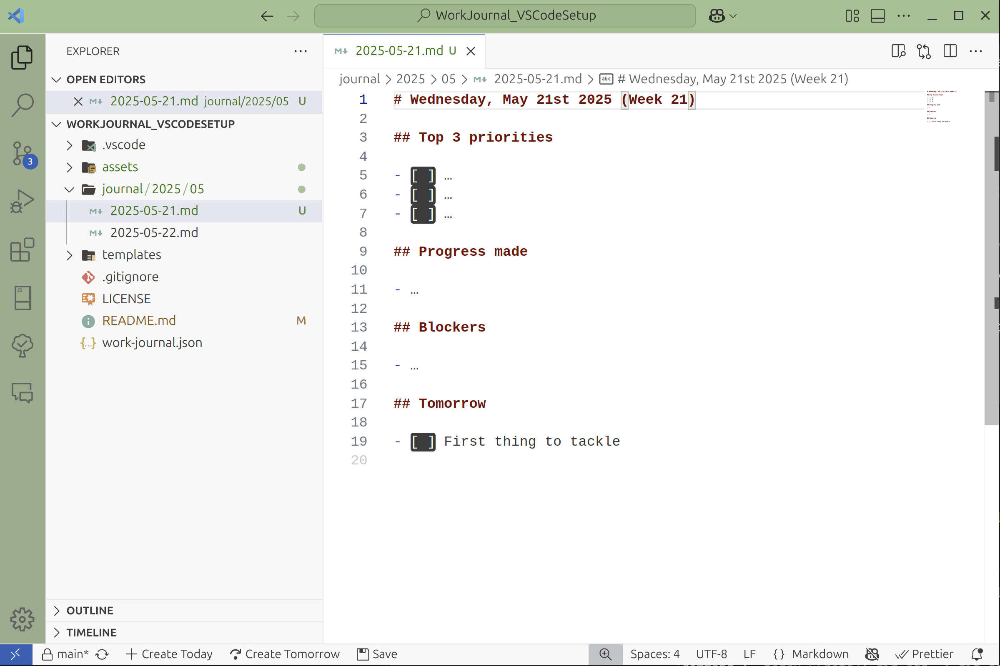
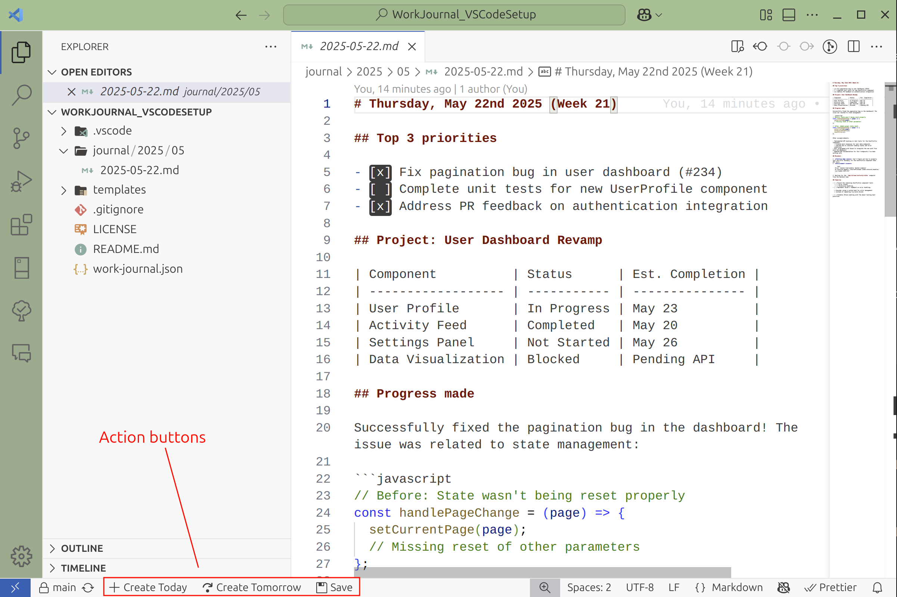

# 🚀 Work-Journal Quickstart for VSCode

> A zero-friction Markdown journaling setup optimized for Visual Studio Code.

> ⚠️ **Warning**: This repo contains a quick-start configuration that you can use if you want to use work-journal with VSCode. To find the actual npm package, go to [work-journal-cli](https://github.com/NicoSchwandner/work-journal-cli)



This repository provides a ready-to-use [Work-Journal](https://github.com/NicoSchwandner/work-journal-cli) configuration tailored specifically for developers using VSCode. Clone the repository, set it up privately, and start tracking your daily tasks, reflections, and progress immediately, with smart, date-based templates to keep you organized effortlessly.

---

## 📌 Features

- **Instant Setup**: Clone, open in VSCode, and start journaling.
- **Daily Automation**: Easily generate journal entries for daily, weekly, monthly, quarterly, or yearly reflections.
- **Smart Templates**: Automatically selects appropriate reflection templates based on the current date.
- **Customizable**: Adjust templates and settings directly within VSCode.
- **Git-Friendly**: Seamlessly integrates with Git for effortless tracking and backup.
- **VSCode Action Buttons**: Quick-access buttons configured directly in VSCode to streamline your journaling workflow.

---

## ⚡ Quickstart

### Step 1: Clone the Repository

Clone this repository locally:

```bash
git clone https://github.com/NicoSchwandner/work-journal-vs-code-setup.git
cd work-journal-vs-code-setup
```

### Step 2: Set Up a Private Repository (Optional but Recommended)

To keep your journal entries private, initialize a new private GitHub repository and push your cloned copy there:

```bash
git remote remove origin
git remote add origin https://github.com/YOUR_USERNAME/YOUR_PRIVATE_REPO.git
git push -u origin main
```

### Step 3: Open in VSCode

```bash
code .
```

### Step 4: Generate Today's Journal Entry

Make sure you have [Node.js](https://nodejs.org/en/download/) installed, then run this command in your VSCode terminal:

```bash
npx work-journal new --open
```

This command:

- Generates a Markdown file at `journal/YYYY/MM/YYYY-MM-DD.md`
- Automatically selects the right template (daily, weekly, monthly, quarterly, yearly)
- Opens the file directly in VSCode.

For full details, see the original [Work-Journal CLI repository](https://github.com/NicoSchwandner/work-journal-cli).

---

## 🛠️ Included Templates

The repository comes with default templates optimized for structured reflections:

- **Daily**: Quick capture of tasks, progress, and blockers
- **Weekly**: Review weekly wins, challenges, and next week's focus
- **Monthly**: Highlight monthly achievements, issues, and set new goals
- **Quarterly**: Reflect deeply each quarter and outline future targets
- **Yearly**: Comprehensive year-end reflection and forward planning

To customize these templates, simply edit files in the `templates/` folder.

---

## 📖 Example Journal Entry

Here's a sample daily journal structure:

```markdown
# 2025-05-22 (Week 21)

## Top 3 priorities

- [ ] Task 1
- [ ] Task 2
- [ ] Task 3

## Progress made

- Fixed critical bug related to pagination state management
- Pair-programmed on authentication integration

## Blockers

- Waiting on backend API
- Testing error boundaries

## Tomorrow

- [ ] Implement feedback
- [ ] Finish tests
```

---

## 🎛️ Configuration

Adjust global journal settings in the `work-journal.json` file:

```json
{
  "holidayCutoffDay": 22
}
```

This defines the cutoff day in December for triggering the yearly reflection.

---

## 🚀 VSCode Action Buttons

This repository is configured with VSCode Action Buttons for quick and easy journaling:



- **Create Today**: Generates and opens today's journal entry.
- **Create Tomorrow**: Prepares tomorrow's journal entry in advance.
- **Save**: Quickly commits and pushes your journal updates to your Git repository.

---

## 🧑‍💻 Recommended VSCode Extensions

Enhance your journaling experience in VSCode with these recommended extensions:

- [Markdown All in One](https://marketplace.visualstudio.com/items?itemName=yzhang.markdown-all-in-one)
- [Markdownlint](https://marketplace.visualstudio.com/items?itemName=davidanson.vscode-markdownlint)
- [Action Buttons](https://marketplace.visualstudio.com/items?itemName=seunlanlege.action-buttons)

---

## 📜 License

Licensed under the [Apache 2.0 License](LICENSE).

---

📝 **Happy journaling!**
